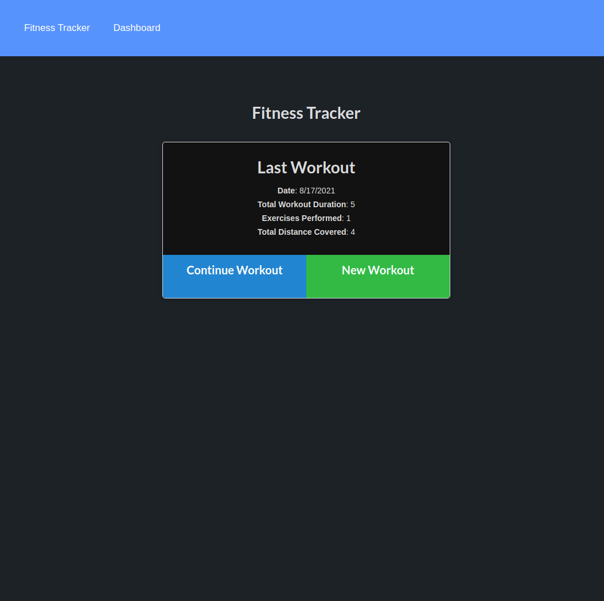

# Workout Tracker

    
    

## Table of Contents
    
* [Description](#description)
* [Installation](#installation-instructions)
* [Usage Info](#usage-info)
* [contribution](#contribution)
* [Testing Instructions](#test-instructions)
* [License](#license)
* [Questions](#questions)
    

## Description
    A Easy to user workout tracker where you can keep a record of your routine.
    The added graphs help you understand how your workout is progressing. 
    You have the option to add data regarding either cardio or resistance workouts.

## Installation Instructions
    No installation necessary. 

## Usage info
    To start using the app click on new workout and add the exercises on the following screen.
    After you are done with your workout click on complete and once you get back to the main 
    screen you last workout data will be available for you to see. You can also start seeing 
    the statistics on the dashboard..

## Contribution
    contribution is welcome upon request.

## Test Instructions
    undefined.    

## License
    This project is covered under MIT license.

## Questions
    For questions please refer to 
      
    or
    romulojusto@gmail.com
    
